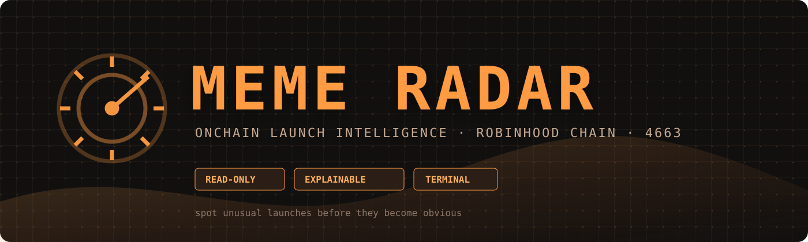

<div align="center">


# MEME RADAR

### Onchain launch intelligence for Robinhood Chain



<p>
  <a href="https://github.com/neolakseri-commits/Meme-Radar/actions"></a>
  
  
  
  
</p>

<p><strong>Find the unusual launch. Read the evidence. Decide for yourself.</strong></p>

</div>

## What it does

Meme Radar watches Robinhood Chain launches and turns the first observable activity into a compact, explainable profile. It is a local terminal tool for research and triage — it does not trade, custody funds, or ask for a private key.

| Question | Evidence | Terminal answer |
| --- | --- | --- |
| Is this launch unusual? | launch state, curve, tax, early flow | `SCORE 87/100` |
| Is the deployer experienced? | prior launches and graduations | `deployer history` |
| Is the early demand broad? | first curve buys and unique buyers | `14 independent buyers` |
| Is supply concentrated? | creator buy and observed early wallets | `18% concentration` |
| Does it resemble a farm? | repeated deployer and wallet fingerprints | `farm warning` |

The output is deliberately evidence-first. A score is only useful when the reasons underneath it are visible.

## Quick start

```bash
npm install
cp .env.example .env
npm run doctor
npm run hunt
```

PowerShell:

```powershell
npm install
Copy-Item .env.example .env
npm run doctor
npm run hunt
```

Run the offline demo without RPC access:

```bash
npm run demo
```

Inspect one token directly:

```bash
npm run scan -- 0xTokenAddress
```

## Commands

| Command | Purpose | Network |
| --- | --- | --- |
| `npm run demo` | Render a realistic sample report | no |
| `npm run doctor` | Check RPC connectivity and configured chain | yes |
| `npm run hunt` | Follow new launches and print scored profiles | yes |
| `npm run scan -- <address>` | Enrich and score one token | yes |
| `npm run backfill` | Inspect a recent block window | yes |
| `npm run typecheck` | Validate TypeScript without emitting files | no |
| `npm test` | Run scoring and behavior tests | no |

Useful options:

```bash
npm run hunt -- --no-history --for 60
npm run hunt -- --no-fomo          # hide the quick-trade strip
npm run backfill -- --blocks 100
npm run scan -- 0xTokenAddress --json
```

## Quick trade (Pump.fun / FOMO)

Every card ends with a `⚡ TRADE` strip that turns the detected token into
one-click **buttons** — clickable in any terminal that supports hyperlinks
(iTerm2, WezTerm, Kitty, Windows Terminal, GNOME Terminal, and more):

```text
⚡ TRADE  [Pump.fun] [FOMO] [Pons] [Chart] [Deployer]
```

The native Robinhood-Chain venues (Pons, Blockscout chart, deployer page) are
always wired. The external FOMO apps are template-driven, so you can point them
at whatever front-end you actually trade on:

| Variable | Effect |
| --- | --- |
| `RADAR_FOMO=off` / `--no-fomo` | Hide the quick-trade strip entirely |
| `RADAR_FOMO_APPS` | Custom apps, `Name=url` comma-separated. `{token}` and `{deployer}` are substituted |
| `RADAR_NO_HYPERLINKS=1` | Keep the button labels but disable clickable links |
| `NO_COLOR=1` | Plain, monochrome output for logs and pipes |

```bash
# Wire your own FOMO front-ends
RADAR_FOMO_APPS="Pump.fun=https://pump.fun/{token},Bolt=https://bolt.xyz/t/{token}" npm run hunt
```

The `--json` output also includes a `links` object with the resolved Pons,
chart, deployer, and FOMO URLs for downstream automation.

## Example

```text
▌ 06:56:07   SIGNAL   $WILLOW  ████████████ 100/100  ·curve
▌ WILLOW ROAD MENLO PARK  0x36fe…2eB9
▌
▌ EVIDENCE
▌ +15 dev buy 2.10%                    +10 creator tax 0.00%
▌ +8 2 social links                    +5 no declared bundle wallets
▌ +10 14 early buyers                  -10 supply concentration 18.0%
▌ +15 deployer graduated 3/3
▌
▌ dev buy     2.10% 0.21Ξ              early flow 14 buyers / 16 buys · 2 taxed
▌ curve fill  ▰▱▱▱▱▱ 24.8% 2.01/8.09Ξ  top holder 18.0%
▌ opening tax 0.19%                    bundle     none
▌ deployer    3 launches 3 grad        funding    — indexer adapter
▌
▌ ⚡ TRADE  [Pump.fun] [FOMO] [Pons] [Chart] [Deployer]
▙▄▄▄▄▄▄▄▄▄▄▄▄▄▄▄▄▄▄▄▄▄▄▄▄▄▄▄▄▄▄▄▄▄▄▄▄▄▄▄▄▄▄▄▄▄▄▄▄▄▄▄▄▄▄▄▄▄▄▄▄▄▄▄▄▄▄▄▄▄▄▄▄
```

In a real terminal the left edge, badge, gauge, and metric values are colour-
coded by verdict (orange = signal, yellow = watch, red = no signal), and the
`⚡ TRADE` buttons are clickable. The exact fields depend on what the chain
exposes for the launch and the configured observation window. Missing evidence
is shown as missing; it is not silently converted into a positive signal.

## Signal model

| Signal | Why it matters | Current implementation |
| --- | --- | --- |
| Creator buy | A meaningful creator position changes launch risk | canonical launch transaction when available |
| Early buyers | Breadth is more informative than a single large buy | decoded curve buy events |
| Supply concentration | Detects a launch dominated by a small set of wallets | observed early transfer/buy window |
| Tax and curve state | A high opening tax or unusual curve state can invalidate a setup | factory and token reads |
| Deployer history | Serial launches and graduations provide context | local history/index adapter |
| Wallet fingerprints | Repeated funding or synchronized wallets can indicate farming | warning only when adapter data exists |

Scoring rules are readable and intentionally conservative. See [`docs/SIGNALS.md`](docs/SIGNALS.md) for the current weights and caveats.

## Project layout

```text
MemeRadar/
├─ assets/       GitHub hero banner and project icon
├─ docs/         getting started, signals, architecture, limitations
├─ src/          CLI, chain reads, enrichment, scoring, rendering
├─ test/         deterministic scoring tests
├─ .env.example  safe configuration template
├─ LICENSE       MIT license
└─ README.md     product overview and operating guide
```

## Design principles

- **Read-only by default.** No wallet, signer, swap, or custody code.
- **Explainable output.** Every score is accompanied by positive and negative reasons.
- **Honest uncertainty.** Unsupported evidence is reported as unavailable.
- **Terminal-first.** The tool is useful over SSH, in a local shell, or alongside another trading workflow.
- **Small surface area.** The first version favors a reliable observer over a noisy dashboard.

## Limitations

This is an intelligence prototype, not a guarantee of safety or profit. Funding-wallet clusters, full historical deployer graphs, and richer liquidity analytics require a dedicated indexer or trace provider. Early concentration is limited to the observation window. RPC availability and event indexing can also affect freshness.

Read [`docs/LIMITATIONS.md`](docs/LIMITATIONS.md) before using live output.

## Development

```bash
npm run typecheck
npm test
npm run build
npm run demo
```

The CI workflow runs these checks on Node 20 and Node 22. Generated `dist/`, `node_modules/`, local caches, and `.env` files are intentionally ignored by Git.

## License

MIT — see [`LICENSE`](LICENSE).

<div align="center">
  <sub>Built for research on Robinhood Chain. Never treat a score as financial advice.</sub>
</div>

